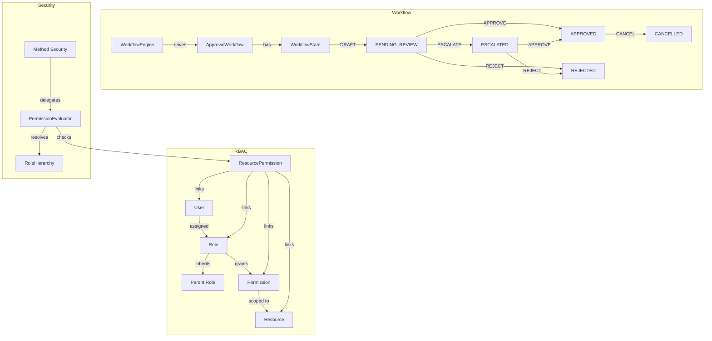

# access-control-engine

Enterprise RBAC + approval workflow orchestration for Spring Boot 3 / Java 21.

## Features

- **Role-Based Access Control (RBAC)** with hierarchical roles
- **Resource-level permissions** – grant per user, role, and resource type
- **Permission evaluator** integrated with Spring Security method security
- **Approval workflow state machine** – custom Camunda-style flows without Camunda dependency

## Practical Use

Drop this into any enterprise Spring Boot application that needs:
- Fine-grained permission checks beyond simple role matching
- Multi-stage approval flows (draft → review → approved/rejected, with escalation)
- Audit-ready access decisions

## Architecture



## Quick Start

```java
// 1. Check permission via Spring Security
@PreAuthorize("hasPermission(#resourceId, 'Document', 'WRITE')")
public void updateDocument(UUID resourceId, DocumentDto dto) { ... }

// 2. Start an approval workflow
ApprovalWorkflow workflow = workflowEngine.start(
    WorkflowContext.builder()
        .resourceId(resourceId)
        .resourceType("PurchaseOrder")
        .initiatorId(currentUserId)
        .build()
);

// 3. Advance the workflow
workflowEngine.transition(workflow.getId(), WorkflowAction.APPROVE, approverId);
```

## API Endpoints

| Method | Path | Description |
|--------|------|-------------|
| `GET` | `/api/v1/roles` | List all roles |
| `POST` | `/api/v1/roles` | Create role |
| `GET` | `/api/v1/roles/{id}/permissions` | Get role permissions |
| `POST` | `/api/v1/permissions` | Create permission |
| `GET` | `/api/v1/resource-permissions` | List resource permissions |
| `POST` | `/api/v1/resource-permissions` | Grant permission |
| `DELETE` | `/api/v1/resource-permissions/{id}` | Revoke permission |
| `POST` | `/api/v1/workflows` | Start approval workflow |
| `GET` | `/api/v1/workflows/{id}` | Get workflow status |
| `POST` | `/api/v1/workflows/{id}/transition` | Advance workflow |
| `GET` | `/api/v1/workflows` | List workflows |

## Build

```bash
./gradlew build
./gradlew test
```

Requires Java 21. `bootJar` is disabled – this project produces a library JAR.

## License

CC BY-NC 4.0 License – Copyright (c) 2026 itiana
