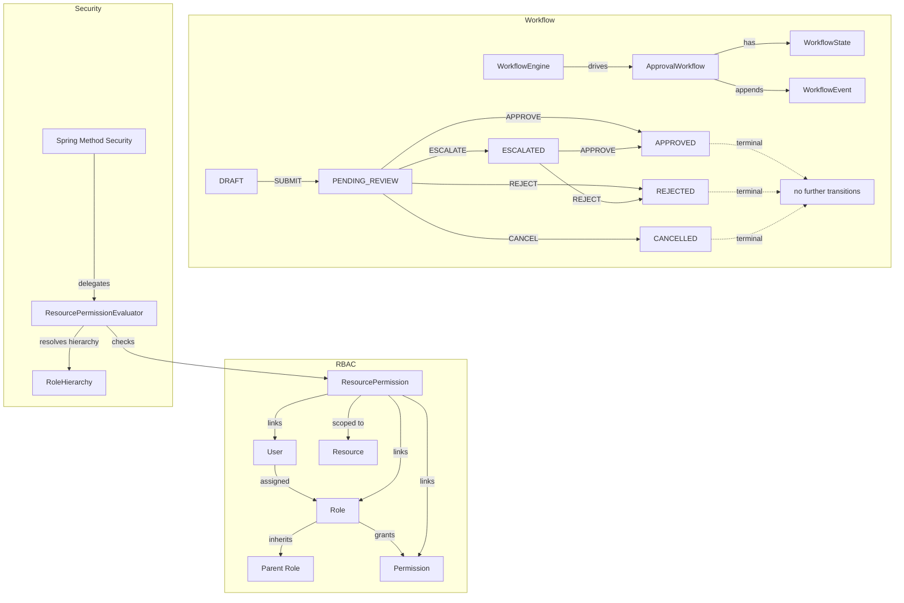

# access-control-engine

Enterprise RBAC and approval workflow orchestration for Spring Boot 3 / Java 21. Provides role hierarchy resolution, resource-level permission evaluation, and a custom approval workflow state machine — without Camunda or any external workflow dependency.

---

## What This Is

A **library JAR** intended to be pulled into a host Spring Boot application. It provides:

- RBAC with multi-level role inheritance
- Per-resource, per-user, per-role permission grants with optional expiry
- Wildcard permissions (`*` action or resource type)
- Spring Security `PermissionEvaluator` integration for `@PreAuthorize` method security
- Approval workflow state machine with audit event trail

## What This Is NOT

- **Not a standalone service.** `bootJar` is disabled. This project produces only a plain JAR.
- **No REST controllers.** The library exposes service interfaces and security beans — the host application defines its own API layer.
- **Not a general-purpose workflow engine.** The state machine is purpose-built for access-control approval flows.

---

## Compatibility

| Dependency          | Version   |
|---------------------|-----------|
| Java                | 21        |
| Spring Boot         | 3.2.5     |
| Spring Security     | 6.x       |
| Flyway              | bundled   |
| H2 (dev profile)    | bundled   |
| Hibernate Spatial   | not used  |

---

## Architecture



---

## Security Model

The library registers a `ResourcePermissionEvaluator` bean as the `PermissionEvaluator` used by Spring Security's method-level `@PreAuthorize` checks.

### Principal Requirements

The evaluator resolves the caller identity by calling `authentication.getName()` and parsing it as a `UUID`. **Authentication principal names must be UUID strings.** Non-UUID principal names throw `AccessControlException` at evaluation time. Configure your JWT or session authentication to set a UUID subject.

### Usage

```java
@PreAuthorize("hasPermission(#resourceId, 'Invoice', 'APPROVE')")
public void approveInvoice(UUID resourceId) { ... }

@PreAuthorize("hasPermission(#resourceId, 'Document', 'READ')")
public DocumentDto getDocument(UUID resourceId) { ... }
```

---

## RBAC Model

### Permissions

A `Permission` is an `(action, resourceType)` pair, stored in the `permissions` table. Actions and resource types are normalized to uppercase on construction. Either field may be `*` to act as a wildcard.

### Roles

A `Role` has a name, an optional description, an optional `parentRole`, and a set of `Permission` objects.

### Role Hierarchy

`RoleHierarchy.resolveEffectiveRoles(UUID roleId)` performs a breadth-first traversal up the parent chain and returns all roles that are transitively inherited. Cycle protection is enforced via `validateNoCycle` before any parent assignment is persisted.

### Grants

A `ResourcePermission` record binds a user or a role to a permission, optionally scoped to a specific resource UUID and resource type. Grants support:

- `expiresAt` — automatic expiry by timestamp
- `revoked` / `GrantState` — explicit revocation
- `grantState` values: `ACTIVE`, `REVOKED`, `EXPIRED`

### Wildcards

When a permission's `action` or `resourceType` is `*`, it matches any value supplied to the evaluator. Wildcard matching is applied in `ResourcePermissionEvaluator.matchesAction()`.

---

## Workflow Model

### States

| State            | Terminal |
|------------------|----------|
| `DRAFT`          | No       |
| `PENDING_REVIEW` | No       |
| `ESCALATED`      | No       |
| `APPROVED`       | Yes      |
| `REJECTED`       | Yes      |
| `CANCELLED`      | Yes      |

### Transitions

| From             | Action     | To               |
|------------------|------------|------------------|
| `DRAFT`          | `SUBMIT`   | `PENDING_REVIEW` |
| `DRAFT`          | `CANCEL`   | `CANCELLED`      |
| `PENDING_REVIEW` | `APPROVE`  | `APPROVED`       |
| `PENDING_REVIEW` | `REJECT`   | `REJECTED`       |
| `PENDING_REVIEW` | `ESCALATE` | `ESCALATED`      |
| `PENDING_REVIEW` | `CANCEL`   | `CANCELLED`      |
| `ESCALATED`      | `APPROVE`  | `APPROVED`       |
| `ESCALATED`      | `REJECT`   | `REJECTED`       |
| `ESCALATED`      | `CANCEL`   | `CANCELLED`      |

Attempting to transition from a terminal state throws `InvalidTransitionException`. Each transition appends an immutable `WorkflowEvent` recording the actor, action, from-state, to-state, timestamp, and optional comment.

---

## Integration Guide

### 1. Add the JAR dependency

The library is not published to Maven Central. Build locally and add to your host project:

```bash
./gradlew jar
# outputs: build/libs/access-control-engine-*.jar
```

### 2. Component scanning

Ensure the host application scans `com.accesscontrol`:

```java
@SpringBootApplication(scanBasePackages = {"com.yourapp", "com.accesscontrol"})
```

### 3. Database

The library owns its schema via Flyway migrations in `classpath:db/migration`. The host application must provide a `DataSource`. For dev, the `dev` Spring profile activates an in-memory H2 database.

### 4. Grant a permission

```java
Permission p = permissionService.create(new CreatePermissionRequest("WRITE", "Document", null));
resourcePermissionService.grant(new GrantPermissionRequest(
    userId, null, p.id(), resourceId, "Document", null, null));
```

### 5. Start a workflow

```java
WorkflowResponse wf = workflowEngine.start(new StartWorkflowRequest(
    resourceId, "PurchaseOrder", initiatorId, "Needs approval"));

workflowEngine.transition(wf.id(), new WorkflowTransitionRequest(
    WorkflowAction.APPROVE, approverId, null, "Looks good"));
```

---

## Known Constraints

- Principal name must be a UUID. Non-UUID names cause an immediate `AccessControlException`.
- Role hierarchy traversal is eager and unbounded in depth. Very deep chains (20+ levels) will produce proportional repository calls.
- `findActiveGrants` requires a non-empty role ID set; a sentinel `UUID(0,0)` is substituted when the user has no direct role assignments. This avoids a query with an empty `IN` clause.
- `@Transactional` is used in `WorkflowEngineImpl` (JPA service). Do not call external services inside those transaction boundaries.

---

## Development

```bash
# Run tests
./gradlew test

# Build JAR
./gradlew jar

# Full build including checks
./gradlew build
```

Active profiles:
- `dev` — H2 in-memory, DDL auto-create, Flyway enabled
- `prod` — expects a real DataSource, Flyway handles schema migration

---

## Release Status

Current version: **0.1.0-alpha**

This library is extracted from a production system and is under active refinement. The API surface (service interfaces, DTOs) may change before a stable 1.0 release.

---

## License

MIT — see [LICENSE](./LICENSE)
